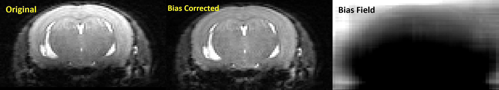

# Rodent MRI Bias Field Correction (rodbfc.py)

**rodbfc.py** is a Python module for performing bias field correction on rodent MRI images. This tool utilizes a pre-trained model to correct intensity inhomogeneities caused by the bias field present in MRI scans of rodents.

## Features
- Corrects bias field artifacts in rodent MRI images.
- Easy-to-use command-line interface.
- Uses a pre-trained model for accurate correction.

## Installation
To use **rodbfc.py**, you'll need to have Python 3 installed. Also please install `monai`, `pytorch`, and `nilearn` python libraries. 
You can install the module by cloning this repository. Pretrained models are available in models directory, named according to date and time when they were trained.


## Usage
```bash
rodbfc.py -i input_filename -m model_filename -o output_filename [-b bias_filename] [--device DEVICE]
```

### Arguments:
- `-h, --help`: Show the help message and exit.
- `-i` or `--input`: Input filename (Uncorrected MRI image filename).
- `-m` or `--model`: Model file (Trained model .pth file).
- -o` or `--output`: Output filename (Bias corrected MRI image filename).
- -b` or `--bias`: Bias field filename (optional).
- `--device`: Device to use for computation (default: "cuda" if available, else "cpu").

### Example:
```bash
rodbfc.py -i input_image.nii.gz -m model_weights.pth -o output_image_corrected.nii.gz
```

Example output:




## Training the model
A pretrained model is included in models directory. If you want to train a new model, you can use the ```main_training.ipynb``` notebook. 


## License
This project is licensed under the GPL (V2) License - see the [LICENSE](License_gpl-2.0.txt) file for details.

## Contributing
Contributions are welcome! Please contact [ajoshi@usc.edu](mailto:ajoshi@usc.edu) for further discussion.

## Acknowledgments
- This tool was developed by [Anand A Joshi](ajoshi@usc.edu) and [Ronald Salloum](rsalloum@usc.edu). This project is supported by NIH Grant R01-NS121761 (PIs: David Shattuck and Allan MacKenzie-Graham).


---

